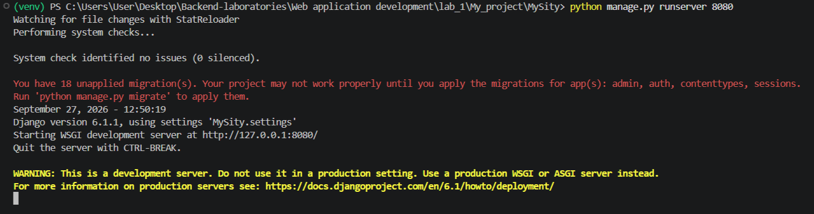
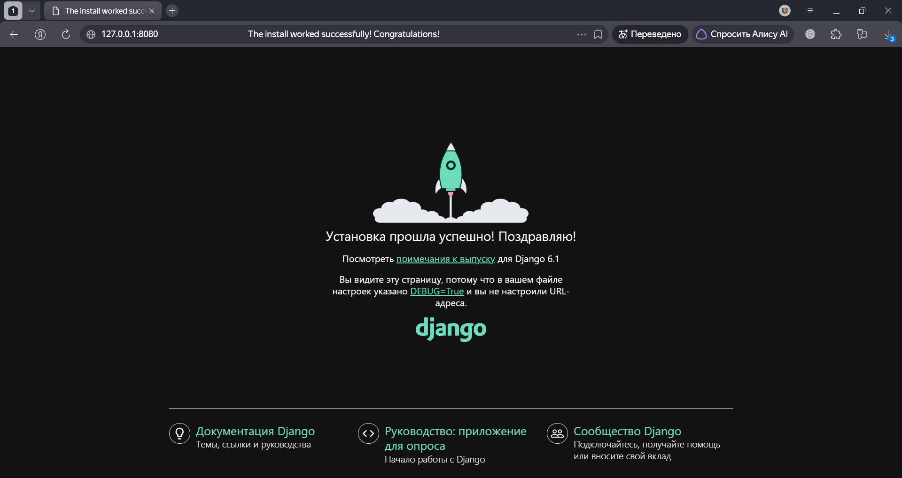
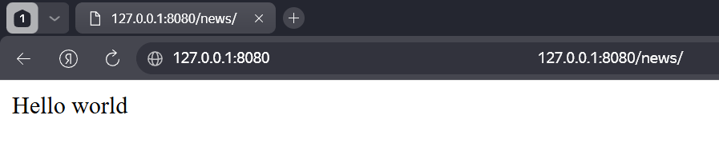
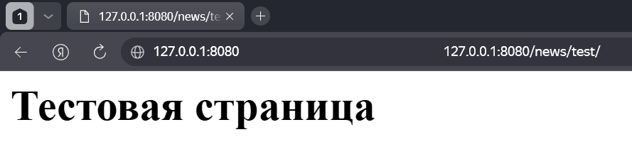
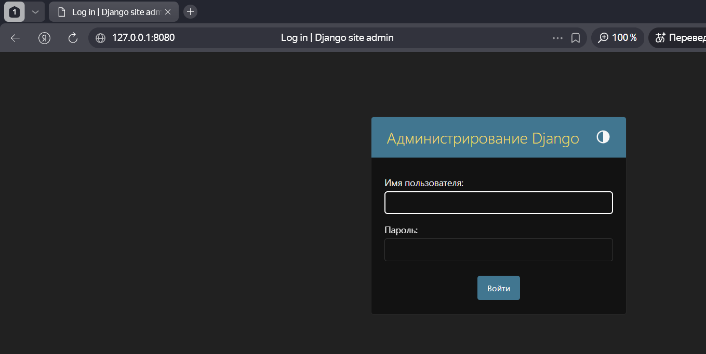
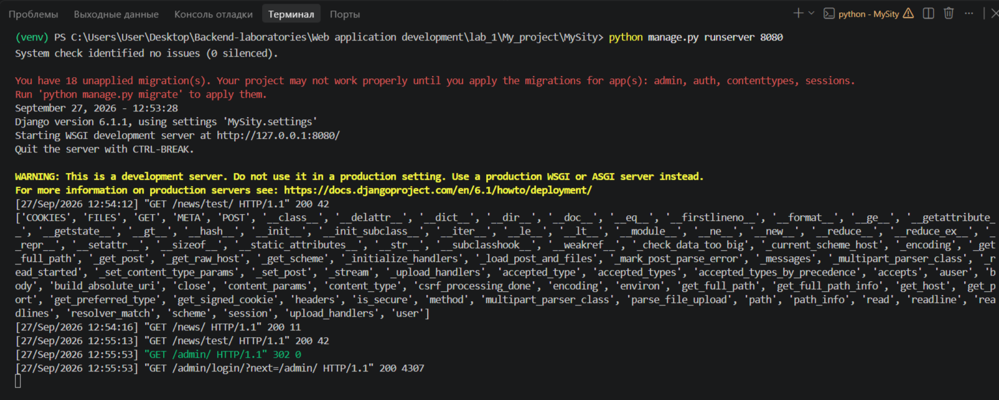

# Лабораторная работа №1. Создание виртуального окружения. Контроллеры и маршруты

**Студент:** Ризаханов Имам Заурович
**Группа:** ПИЖ-б-о-25-2
**Вариант:** 7
**Технология:** Python + Django

---

## Цель работы

Настроить виртуальное пространство. Разработать контроллер приложения и организовать маршруты.

---

## Теоретическое обоснование

**Виртуальное окружение (`venv`)** — изолированная папка с библиотеками для конкретного проекта. Позволяет разным проектам использовать разные версии библиотек без конфликтов.

**Django** — высокоуровневый веб-фреймворк на Python. Структура проекта:

- **Проект** — весь сайт (один)
- **Приложение** — модуль внутри проекта (много)
- **Контроллеры (`views.py`)** — функции обработки запросов
- **Маршруты (`urls.py`)** — связь URL с функциями

**Структура Django-проекта:**

| Элемент | Назначение |
|---------|------------|
| `manage.py` | «Пульт» управления проектом |
| `settings.py` | Настройки проекта |
| `urls.py` | Маршруты |
| `views.py` | Контроллеры |

---

## Выполнение практического примера

### 1. Создание виртуального окружения

```bash
mkdir MyProject
cd MyProject
python -m venv venv
```

### 2. Активация виртуального окружения

```bash
venv\Scripts\activate
```

После активации в начале строки терминала появляется `(venv)`.

### 3. Установка Django

```bash
pip install django
```

Проверка установленных пакетов:

```bash
pip list
```

Результат:

```
Package    Version
---------- -------
asgiref    3.12.1
Django     6.1.1
pip        25.3
sqlparse   0.6.0
tzdata     2026.4
```

### 4. Создание проекта

```bash
django-admin startproject MySity
cd MySity
```

Структура проекта:

```
MySity/
├── manage.py
└── MySity/
    ├── __init__.py
    ├── settings.py
    ├── urls.py
    ├── asgi.py
    └── wsgi.py
```

### 5. Запуск сервера

```bash
python manage.py runserver 8080
```

Скриншот запуска:




При переходе по адресу `http://127.0.0.1:8080/` отображается стартовая страница Django.



### 6. Создание приложения `news`

```bash
python manage.py startapp news
```

Структура приложения:

```
news/
├── __init__.py
├── admin.py
├── apps.py
├── models.py
├── tests.py
├── urls.py
├── views.py
└── migrations/
```

### 7. Регистрация приложения в `settings.py`

```python
INSTALLED_APPS = [
    'django.contrib.admin',
    'django.contrib.auth',
    'django.contrib.contenttypes',
    'django.contrib.sessions',
    'django.contrib.messages',
    'django.contrib.staticfiles',
    'news.apps.NewsConfig',
]
```

### 8. Создание контроллеров в `news/views.py`

```python
from django.shortcuts import render
from django.http import HttpResponse

def index(request):
    return HttpResponse('Hello world')

def test(request):
    return HttpResponse('<h1>Тестовая страница</h1>')
```


### 9. Создание `news/urls.py`

```python
from django.urls import path
from .views import index, test

urlpatterns = [
    path('', index),
    path('test/', test),
]
```


### 10. Настройка главного `MySity/urls.py`

```python
from django.contrib import admin
from django.urls import path, include

urlpatterns = [
    path('admin/', admin.site.urls),
    path('news/', include('news.urls')),
]
```


### 11. Запуск сервера и проверка

```bash
python manage.py runserver 8080
```

#### Корневой маршрут `/news/`

При переходе по адресу `http://127.0.0.1:8080/news/` возвращается текст "Hello world".



#### Маршрут `/news/test/`

При переходе по адресу `http://127.0.0.1:8080/news/test/` возвращается заголовок "Тестовая страница".



#### Админка `/admin/`

При переходе по адресу `http://127.0.0.1:8080/admin/` открывается страница входа в админку Django.



#### Логирование в терминале

Все запросы отображаются в терминале с указанием метода, URL и кода ответа.



---

## Контрольные вопросы

**1. Что такое виртуальное окружение и зачем оно нужно?**

Виртуальное окружение (`venv`) — изолированная папка с библиотеками для конкретного проекта. Нужно, чтобы проекты не конфликтовали версиями библиотек.

**2. Как создать и активировать `venv`?**

```bash
python -m venv venv           # создание
venv\Scripts\activate         # активация (Windows)
```

**3. Что такое Django-проект и приложение?**

Проект — весь сайт (один). Приложение — модуль внутри проекта (много). Приложение решает одну задачу.

**4. Что такое `manage.py`?**

«Пульт управления» проектом. Через него запускаются все команды Django.

**5. Что такое контроллеры и маршруты?**

Контроллеры (`views.py`) — функции обработки запросов. Маршруты (`urls.py`) — связь URL с функциями.

**6. Как работает маршрутизация в Django?**

Двухуровневая:

1. Главный `urls.py` — направляет в приложение
2. `news/urls.py` — выбирает функцию

**7. Что такое `include()`?**

Функция для подключения маршрутов приложения в главный `urls.py`.

**8. Что такое `HttpResponse`?**

Класс для формирования HTTP-ответа. Принимает строку или HTML.

**9. Какие коды ответов возвращает Django?**

- `200 OK` — успешный запрос
- `404 Not Found` — маршрут не найден
- `500 Internal Server Error` — ошибка сервера

**10. Что такое `print(dir(request))`?**

Отладочная команда, показывает все атрибуты объекта `request` (method, path, GET, POST и др.).

