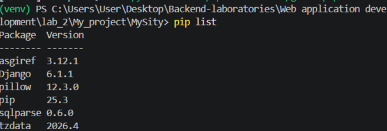
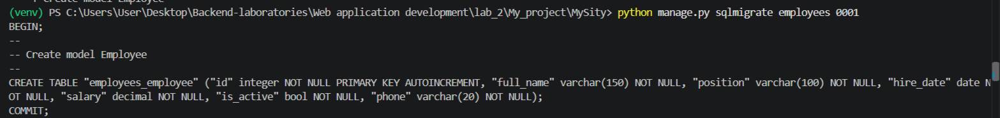
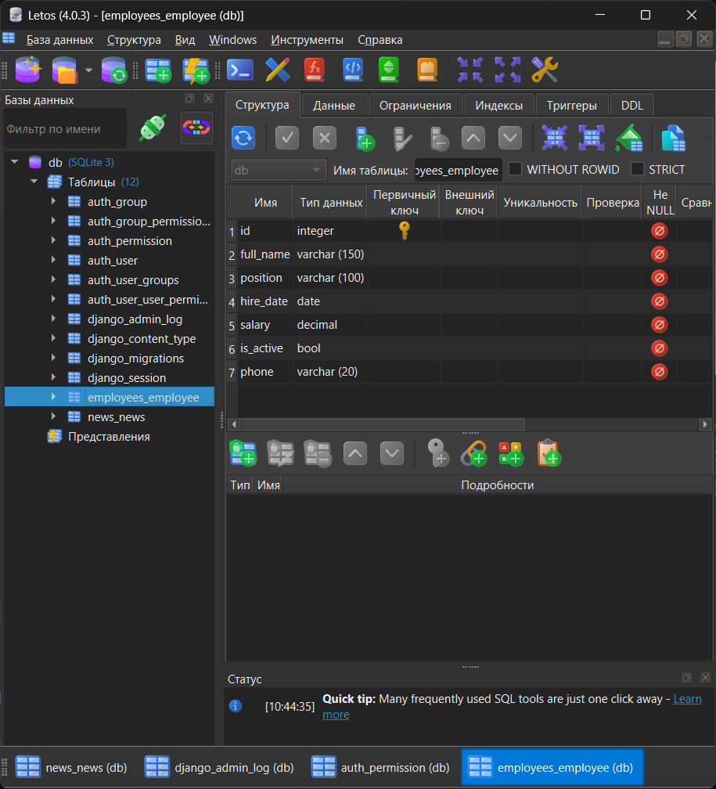
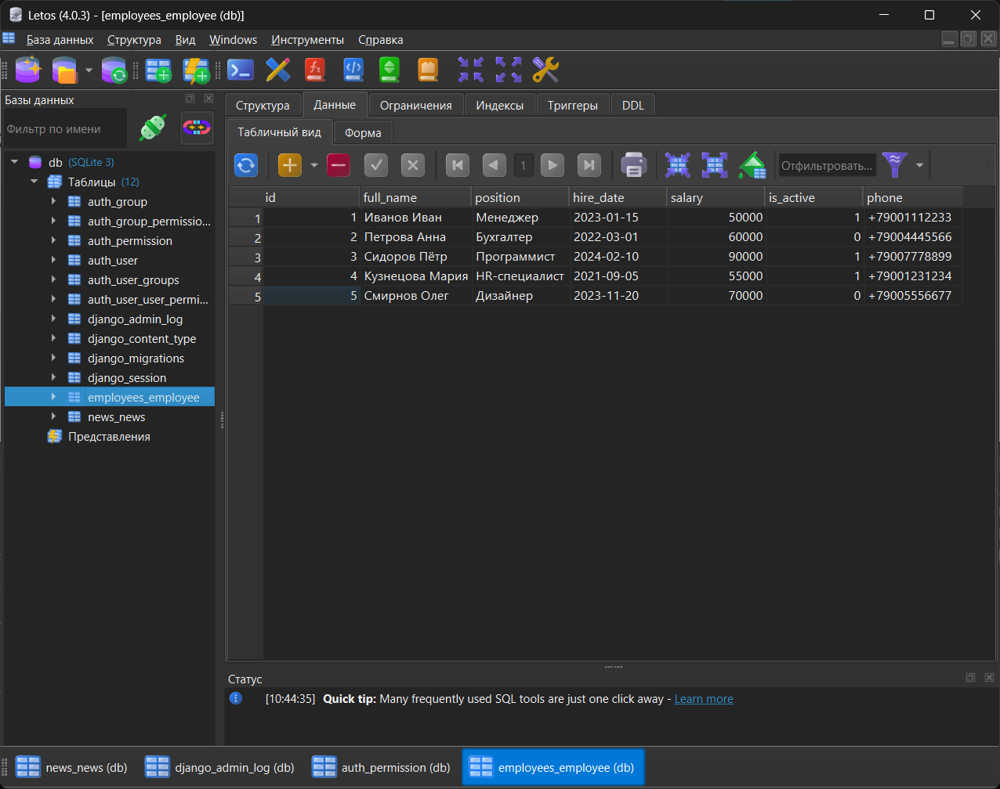
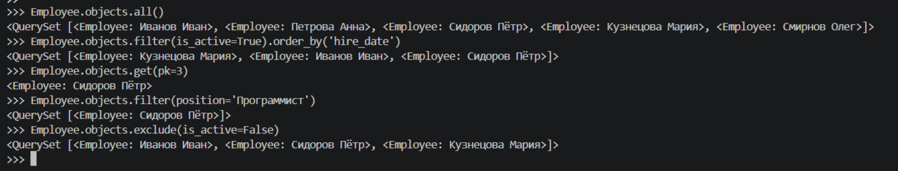
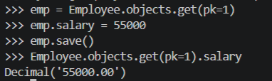
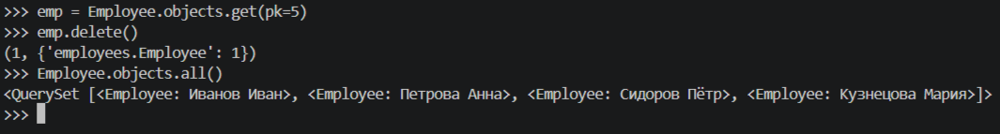
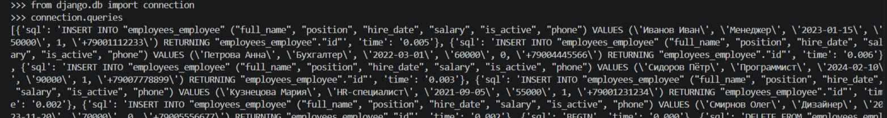

# Лабораторная работа №2. Модели, миграции, ORM

**Студент:** Ризаханов Имам Заурович  
**Группа:** ПИЖ-б-о-25-2  
**Вариант:** 7  
**Технология:** Python + Django

---

## Цель работы

Изучить работу с моделями Django, освоить миграции и работу с базой данных через ORM. Отработать CRUD-операции через консоль Django. Закрепить навыки настройки медиафайлов и регистрации моделей в административной панели.

---

## Теоретическое обоснование

**Модель (Model)** — ключевой компонент архитектуры MTV (Model-Template-View). Отвечает за слой данных: описывает структуру таблицы в БД и предоставляет методы для работы с ней. Каждая модель наследуется от `django.db.models.Model`.

**Поля моделей** — определяют тип данных столбца в БД:

| Поле | Назначение |
|------|------------|
| `CharField` | Строка фиксированной длины (требует `max_length`) |
| `TextField` | Текст большого объёма |
| `DateTimeField` | Дата и время |
| `ImageField` | Загрузка изображений (требует Pillow) |
| `BooleanField` | Логическое значение (True/False) |
| `DecimalField` | Число с фиксированной точностью |
| `DateField` | Дата |

**Параметры полей:**

- `blank=True` — поле может быть пустым в формах
- `null=True` — поле может хранить NULL в БД
- `auto_now_add` — устанавливает текущую дату при создании объекта
- `auto_now` — обновляет дату при каждом сохранении
- `upload_to` — подкаталог для загрузки медиафайлов
- `default` — значение по умолчанию

**Миграции** — механизм Django для отслеживания и применения изменений в структуре таблиц. Основные команды:

```bash
python manage.py makemigrations     # создать файлы миграций
python manage.py migrate            # применить миграции
python manage.py sqlmigrate <app> <migration_name>  # показать SQL
```

**ORM (Object-Relational Mapping)** — позволяет работать с БД через Python-код без SQL. Основные CRUD-операции:

- **Create:** `Model.objects.create(...)` или `obj = Model(...); obj.save()`
- **Read:** `all()`, `filter()`, `get()`, `exclude()`, `order_by()`
- **Update:** изменить атрибут и вызвать `save()`
- **Delete:** вызвать `delete()` у объекта

**Медиафайлы:** для загрузки изображений настраиваются константы `MEDIA_ROOT` и `MEDIA_URL` в `settings.py`, а в корневом `urls.py` добавляется маршрут через `static()` (только в режиме `DEBUG=True`).

---

## Выполнение работы

### 1. Проверка виртуального окружения и установка Pillow

Проект `MySity` создан в лабораторной работе №1. Убеждаемся, что виртуальное окружение активно (в терминале есть `(venv)`), и устанавливаем библиотеку Pillow для работы с изображениями:

```bash
pip install Pillow
```

Проверка установки:

```bash
pip list
```



### 2. Создание приложения `employees`

Создаём новое приложение рядом с `news`:

```bash
python manage.py startapp employees
```


### 3. Регистрация приложения в `settings.py`

```python
INSTALLED_APPS = [
    'django.contrib.admin',
    'django.contrib.auth',
    'django.contrib.contenttypes',
    'django.contrib.sessions',
    'django.contrib.messages',
    'django.contrib.staticfiles',
    'news.apps.NewsConfig',
    'employees.apps.EmployeesConfig',
]
```

### 4. Создание модели `Employee` в `employees/models.py`

```python
from django.db import models

class Employee(models.Model):
    full_name = models.CharField(max_length=150)
    position = models.CharField(max_length=100)
    hire_date = models.DateField()
    salary = models.DecimalField(max_digits=10, decimal_places=2)
    is_active = models.BooleanField(default=True)
    phone = models.CharField(max_length=20, blank=True)

    def __str__(self):
        return self.full_name
```

### 5. Создание миграций

```bash
python manage.py makemigrations
```

Посмотрим SQL-запрос, который будет выполнен:

```bash
python manage.py sqlmigrate employees 0001
```

Результат:



### 6. Применение миграций

```bash
python manage.py migrate
```

БД после миграций в SQLiteStudio:



### 7. Настройка медиафайлов (для модели `News` из ЛБ2)

В `settings.py` в конце файла:

```python
MEDIA_ROOT = os.path.join(BASE_DIR, 'media')
MEDIA_URL = '/media/'
```

В корневом `MySity/urls.py`:

```python
from django.conf import settings
from django.conf.urls.static import static

if settings.DEBUG:
    urlpatterns += static(settings.MEDIA_URL, document_root=settings.MEDIA_ROOT)
```

### 8. Работа с ORM через консоль Django

Запускаем консоль:

```bash
python manage.py shell
```

Импортируем модель:

```python
from employees.models import Employee
```

#### Create — создание записей

```python
Employee.objects.create(full_name='Иванов Иван', position='Менеджер', hire_date='2023-01-15', salary=50000, phone='+79001112233')
Employee.objects.create(full_name='Петрова Анна', position='Бухгалтер', hire_date='2022-03-01', salary=60000, is_active=False, phone='+79004445566')
Employee.objects.create(full_name='Сидоров Пётр', position='Программист', hire_date='2024-02-10', salary=90000, phone='+79007778899')
Employee.objects.create(full_name='Кузнецова Мария', position='HR-специалист', hire_date='2021-09-05', salary=55000, phone='+79001231234')
Employee.objects.create(full_name='Смирнов Олег', position='Дизайнер', hire_date='2023-11-20', salary=70000, is_active=False, phone='+79005556677')
```



Скриншот: таблица employees_employee в SQLiteStudio с 5 созданными сотрудниками


#### Read — чтение записей

Все записи:

```python
Employee.objects.all()
```

**Активные сотрудники, отсортированные по дате приёма:**

```python
Employee.objects.filter(is_active=True).order_by('hire_date')
```


#### Дополнительные операции

Получение одной записи:

```python
Employee.objects.get(pk=3)
```


Фильтрация по должности:

```python
Employee.objects.filter(position='Программист')
```


Исключение неактивных:

```python
Employee.objects.exclude(is_active=False)
```

Скриншот: вывод команд Read через ORM



#### Update — обновление записи

```python
emp = Employee.objects.get(pk=1)
emp.salary = 55000
emp.save()
```

Проверяем:

```python
Employee.objects.get(pk=1).salary
```

Скриншот: вывод команд Update через ORM


#### Delete — удаление записи

```python
emp = Employee.objects.get(pk=5)
emp.delete()
```

Проверяем, что записи больше нет:

```python
Employee.objects.all()
```

Скриншот: вывод команд Delete через ORM



### 9. Просмотр SQL-запросов

В консоли Django:

```python
from django.db import connection
connection.queries
```

Скриншот: SQL-запросы



---

## Контрольные вопросы

**1. Что такое модель в Django и для чего она используется?**  
Модель — это класс Python, описывающий структуру таблицы в базе данных. Используется для хранения и обработки данных предметной области. Каждая модель наследуется от `django.db.models.Model` и соответствует одной таблице в БД.

**2. Какие типы полей вы знаете? Приведите примеры.**  
- `CharField` — строка ограниченной длины (`title = CharField(max_length=150)`)  
- `TextField` — длинный текст (`content = TextField()`)  
- `DateTimeField` — дата и время (`created_at = DateTimeField(auto_now_add=True)`)  
- `DateField` — дата (`hire_date = DateField()`)  
- `ImageField` — изображение (`photo = ImageField(upload_to='photos/')`)  
- `BooleanField` — True/False (`is_active = BooleanField(default=True)`)  
- `DecimalField` — число с плавающей точкой (`salary = DecimalField(max_digits=10, decimal_places=2)`)

**3. Чем отличаются параметры `blank=True` и `null=True`?**  
- `blank=True` — поле может быть пустым **в формах** (валидация уровня приложения).  
- `null=True` — поле может хранить **NULL** в базе данных (уровень БД).  
Они независимы: для строк обычно используют только `blank=True`, для не-строковых (`DateField`, `DecimalField`) — оба.

**4. Что такое миграции и зачем они нужны? Опишите основные команды.**  
Миграции — это способ Django отслеживать и применять изменения в структуре моделей к схеме БД. Они позволяют безопасно и воспроизводимо обновлять таблицы.

Команды:

```bash
python manage.py makemigrations          # создать миграции
python manage.py migrate                 # применить миграции
python manage.py sqlmigrate app 0001     # показать SQL
python manage.py showmigrations          # список миграций
```

**5. Как создать суперпользователя для доступа к административной панели Django?**

```bash
python manage.py createsuperuser
```

Ввести логин, email и пароль. После этого зайти на `/admin/`.

**6. Что такое ORM? Перечислите основные методы для выполнения операций CRUD.**  
ORM (Object-Relational Mapping) — технология связи объектов Python с таблицами БД. Позволяет работать с БД без SQL.

CRUD-методы:

- **Create:** `Model.objects.create(...)`, `obj.save()`  
- **Read:** `all()`, `filter()`, `get()`, `exclude()`  
- **Update:** изменение атрибута + `save()`  
- **Delete:** `obj.delete()`

**7. В чём разница между методами `filter()` и `get()`?**  
- `filter()` — возвращает `QuerySet` (может быть 0, 1 или много записей).  
- `get()` — возвращает ровно один объект; если найдено 0 или больше одного — выбрасывает исключение `DoesNotExist` или `MultipleObjectsReturned`.

**8. Как настроить загрузку изображений (медиафайлов) в проекте Django?**  
1. Установить Pillow.  
2. В `settings.py` задать `MEDIA_ROOT` и `MEDIA_URL`.  
3. В корневом `urls.py` добавить маршрут через `static()` (при `DEBUG=True`).  
4. В модели использовать `ImageField(upload_to='...')`.

**9. Для чего нужен метод `__str__` в модели?**  
`__str__` возвращает строковое представление объекта. Используется в админке, консоли и шаблонах для читаемого вывода (например, «Иванов Иван» вместо «Employee object (1)»).

**10. Что произойдёт, если выполнить `makemigrations`, но не выполнить `migrate`?**  
Файлы миграций будут созданы, но изменения **не применятся** к базе данных. Соответствующая таблица не появится, и попытка работать с моделью через ORM вызовет ошибку `OperationalError: no such table`.
